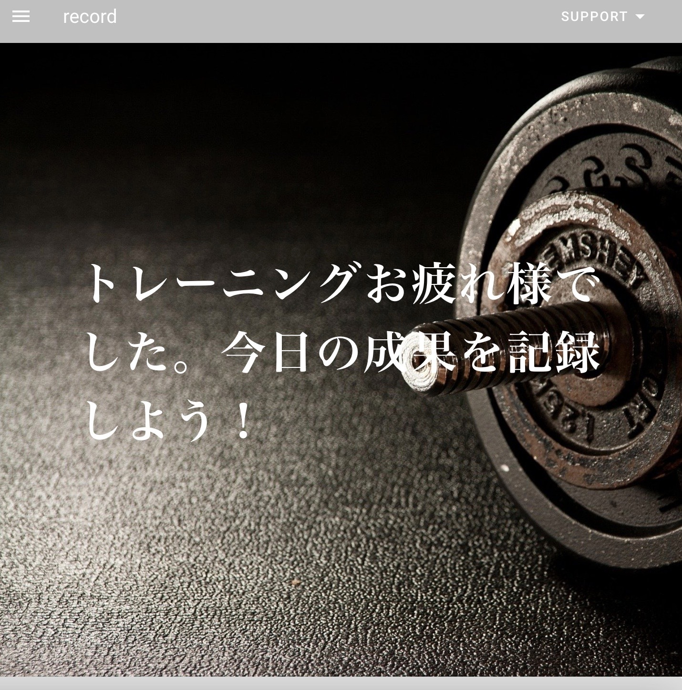
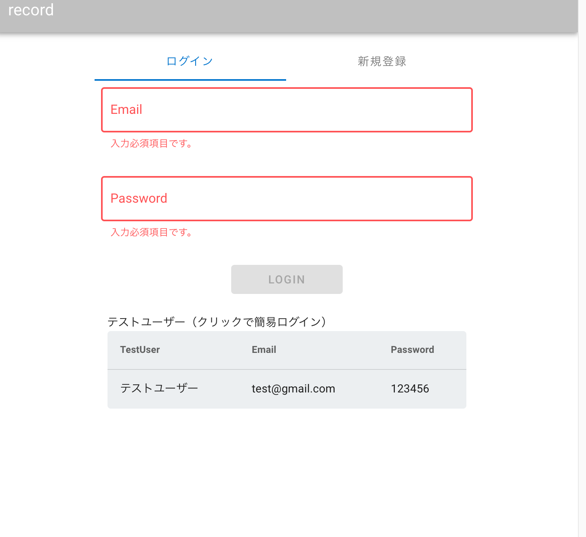
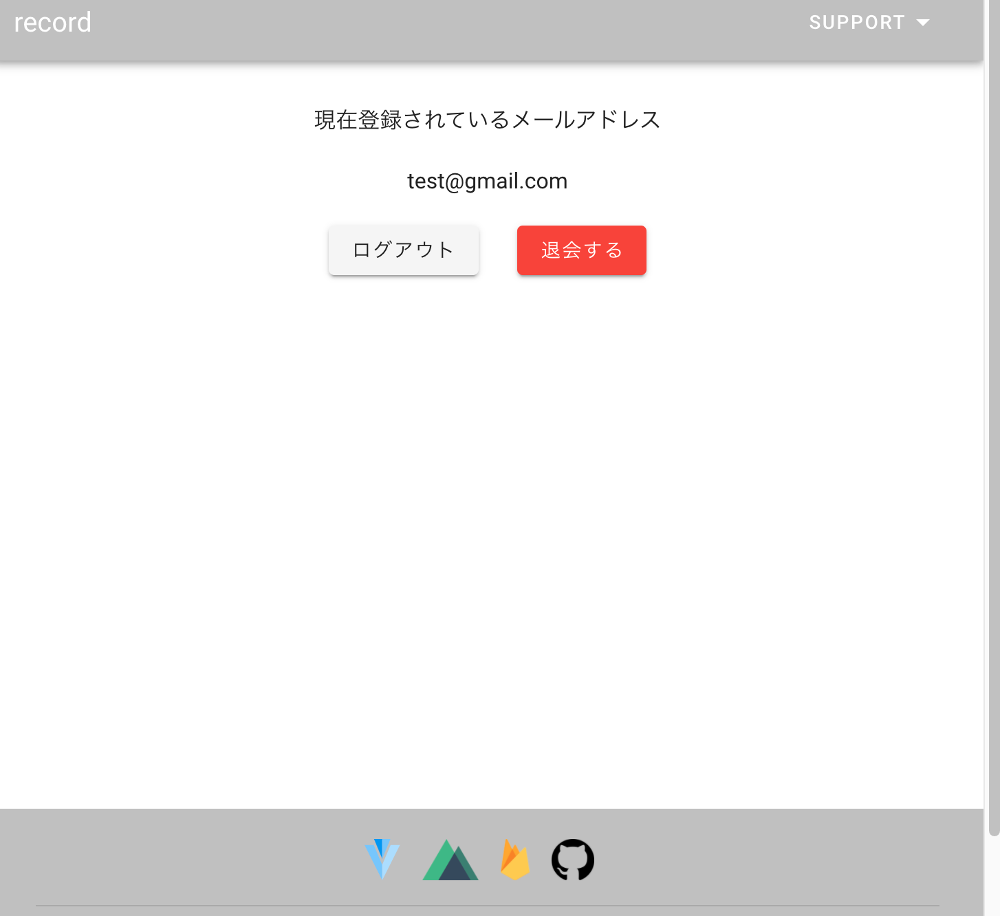
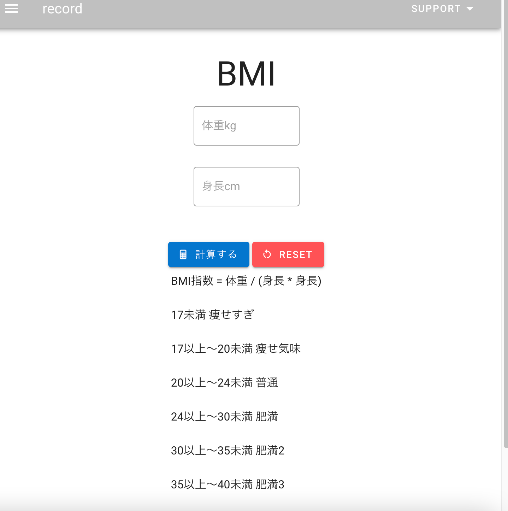
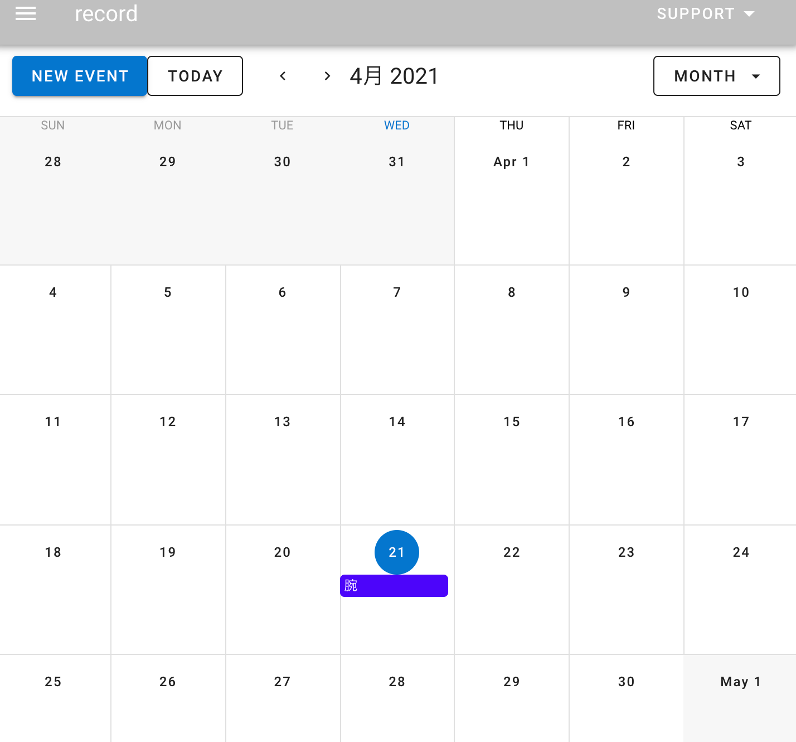
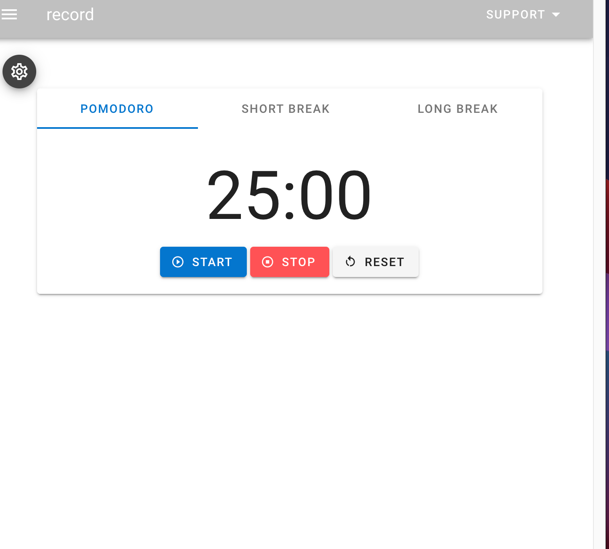

# record

# newRead 
- 概要
<br>
トレーニングの記録とトレーニングに使用するもの

## Description
- 詳細の説明
<br>
カレンダーの方にトレーニング内容の記録と編集、削除
BMIの測定
トレーニング時に使用するカウントダウンタイマー

## 本番環境
record-832b2.firebaseapp.com


## 制作背景（意図）
自分がトレーニング上で記録をしていなかったので記録するアプリが欲しかった。
体重も増えてきていたのでBMIの測定機能を入れて自分の体重が標準体重までどのくらいなのかを
計算できる機能とトレーニング時に使用できるカウンドダウンタイマーが欲しかったのでこのアプリを作成した。

## DEMO
### トップページ


### 新規登録画面

### ログアウト退会画面


### BMI画面


### calendar画面


### countdowntimer画面


## 工夫したポイント
カレンダーの記録にはfirebaseを使用して
トレーニングした部位とトレーニングした内容の登録、編集、削除を出来る様にした。
BMIの測定には体重と身長を入力すればBMI指数と標準体重、適正体重まで何キロなのかと自分の今の肥満度の測定を出せるようにした。
カウントダウンタイマーでは分数の設定と
タイマー終了時にアラームがなるように設定した事。

## 使用技術（開発環境）

### バックエンド
- firebase
- node.js

### フロントエンド
- Nuxt.js
- Vuetify

### データベース
- FireStore

### ソース管理
- GitHub

### テスト
- Jest

### エディタ
- VSCode

## 課題と今後実装したい機能
課題としてはfirebaseを使用しての管理。
登録と編集と削除。現時点ではgoogle認証だけなので
他の方法での登録等が出来るようになる事。

## Build Setup

```bash
# install dependencies
$ npm install

# serve with hot reload at localhost:3000
$ npm run dev

# build for production and launch server
$ npm run build
$ npm run start

# generate static project
$ npm run generate
```

For detailed explanation on how things work, check out [Nuxt.js docs](https://nuxtjs.org).
